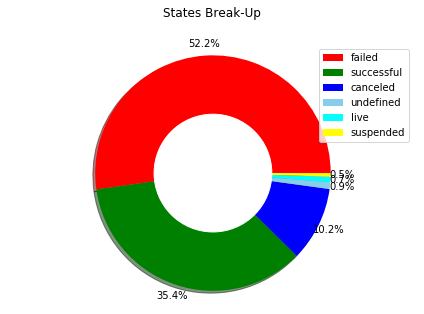
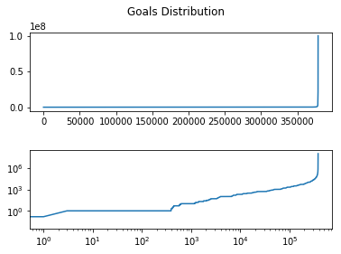

# Analysing the Data!


```python
import pandas as pd
import numpy as np
import matplotlib.pyplot as plt

df = pd.read_csv('KS.csv')
df.head()
```


<div>
<style scoped>
    .dataframe tbody tr th:only-of-type {
        vertical-align: middle;
    }

</style>
<table border="1" class="dataframe">
  <thead>
    <tr style="text-align: right;">
      <th></th>
      <th>ID</th>
      <th>name</th>
      <th>category</th>
      <th>main_category</th>
      <th>currency</th>
      <th>deadline</th>
      <th>goal</th>
      <th>launched</th>
      <th>pledged</th>
      <th>state</th>
      <th>backers</th>
      <th>country</th>
      <th>usd pledged</th>
      <th>usd_pledged_real</th>
      <th>usd_goal_real</th>
    </tr>
  </thead>
  <tbody>
    <tr>
      <th>0</th>
      <td>1000002330</td>
      <td>The Songs of Adelaide &amp; Abullah</td>
      <td>Poetry</td>
      <td>Publishing</td>
      <td>GBP</td>
      <td>2015-10-09</td>
      <td>1000.0</td>
      <td>2015-08-11 12:12:28</td>
      <td>0.0</td>
      <td>failed</td>
      <td>0</td>
      <td>GB</td>
      <td>0.0</td>
      <td>0.0</td>
      <td>1533.95</td>
    </tr>
    <tr>
      <th>1</th>
      <td>1000003930</td>
      <td>Greeting From Earth: ZGAC Arts Capsule For ET</td>
      <td>Narrative Film</td>
      <td>Film &amp; Video</td>
      <td>USD</td>
      <td>2017-11-01</td>
      <td>30000.0</td>
      <td>2017-09-02 04:43:57</td>
      <td>2421.0</td>
      <td>failed</td>
      <td>15</td>
      <td>US</td>
      <td>100.0</td>
      <td>2421.0</td>
      <td>30000.00</td>
    </tr>
    <tr>
      <th>2</th>
      <td>1000004038</td>
      <td>Where is Hank?</td>
      <td>Narrative Film</td>
      <td>Film &amp; Video</td>
      <td>USD</td>
      <td>2013-02-26</td>
      <td>45000.0</td>
      <td>2013-01-12 00:20:50</td>
      <td>220.0</td>
      <td>failed</td>
      <td>3</td>
      <td>US</td>
      <td>220.0</td>
      <td>220.0</td>
      <td>45000.00</td>
    </tr>
    <tr>
      <th>3</th>
      <td>1000007540</td>
      <td>ToshiCapital Rekordz Needs Help to Complete Album</td>
      <td>Music</td>
      <td>Music</td>
      <td>USD</td>
      <td>2012-04-16</td>
      <td>5000.0</td>
      <td>2012-03-17 03:24:11</td>
      <td>1.0</td>
      <td>failed</td>
      <td>1</td>
      <td>US</td>
      <td>1.0</td>
      <td>1.0</td>
      <td>5000.00</td>
    </tr>
    <tr>
      <th>4</th>
      <td>1000011046</td>
      <td>Community Film Project: The Art of Neighborhoo...</td>
      <td>Film &amp; Video</td>
      <td>Film &amp; Video</td>
      <td>USD</td>
      <td>2015-08-29</td>
      <td>19500.0</td>
      <td>2015-07-04 08:35:03</td>
      <td>1283.0</td>
      <td>canceled</td>
      <td>14</td>
      <td>US</td>
      <td>1283.0</td>
      <td>1283.0</td>
      <td>19500.00</td>
    </tr>
  </tbody>
</table>
</div>


```python
percent_missing = (df.isnull().sum() * 100 / len(df)).round(2)
missing_value_df = pd.DataFrame({'percent_missing': percent_missing})
missing_value_df.sort_values('percent_missing', ascending=False, inplace=True)
missing_value_df
```


<div>
<style scoped>
    .dataframe tbody tr th:only-of-type {
        vertical-align: middle;
    }

</style>
<table border="1" class="dataframe">
  <thead>
    <tr style="text-align: right;">
      <th></th>
      <th>percent_missing</th>
    </tr>
  </thead>
  <tbody>
    <tr>
      <th>usd pledged</th>
      <td>1.0</td>
    </tr>
    <tr>
      <th>ID</th>
      <td>0.0</td>
    </tr>
    <tr>
      <th>name</th>
      <td>0.0</td>
    </tr>
    <tr>
      <th>category</th>
      <td>0.0</td>
    </tr>
    <tr>
      <th>main_category</th>
      <td>0.0</td>
    </tr>
    <tr>
      <th>currency</th>
      <td>0.0</td>
    </tr>
    <tr>
      <th>deadline</th>
      <td>0.0</td>
    </tr>
    <tr>
      <th>goal</th>
      <td>0.0</td>
    </tr>
    <tr>
      <th>launched</th>
      <td>0.0</td>
    </tr>
    <tr>
      <th>pledged</th>
      <td>0.0</td>
    </tr>
    <tr>
      <th>state</th>
      <td>0.0</td>
    </tr>
    <tr>
      <th>backers</th>
      <td>0.0</td>
    </tr>
    <tr>
      <th>country</th>
      <td>0.0</td>
    </tr>
    <tr>
      <th>usd_pledged_real</th>
      <td>0.0</td>
    </tr>
    <tr>
      <th>usd_goal_real</th>
      <td>0.0</td>
    </tr>
  </tbody>
</table>
</div>


```python
df[df['usd pledged'].isnull()].head()
```


<div>
<style scoped>
    .dataframe tbody tr th:only-of-type {
        vertical-align: middle;
    }

</style>
<table border="1" class="dataframe">
  <thead>
    <tr style="text-align: right;">
      <th></th>
      <th>ID</th>
      <th>name</th>
      <th>category</th>
      <th>main_category</th>
      <th>currency</th>
      <th>deadline</th>
      <th>goal</th>
      <th>launched</th>
      <th>pledged</th>
      <th>state</th>
      <th>backers</th>
      <th>country</th>
      <th>usd pledged</th>
      <th>usd_pledged_real</th>
      <th>usd_goal_real</th>
    </tr>
  </thead>
  <tbody>
    <tr>
      <th>169</th>
      <td>1000694855</td>
      <td>STREETFIGHTERZ WHEELIE MURICA</td>
      <td>Film &amp; Video</td>
      <td>Film &amp; Video</td>
      <td>USD</td>
      <td>2014-09-20</td>
      <td>6500.0</td>
      <td>2014-08-06 21:28:36</td>
      <td>555.00</td>
      <td>undefined</td>
      <td>0</td>
      <td>N,0"</td>
      <td>NaN</td>
      <td>555.00</td>
      <td>6500.00</td>
    </tr>
    <tr>
      <th>328</th>
      <td>100149523</td>
      <td>Duncan Woods - Chameleon EP</td>
      <td>Music</td>
      <td>Music</td>
      <td>AUD</td>
      <td>2015-08-25</td>
      <td>4500.0</td>
      <td>2015-08-04 12:05:17</td>
      <td>4767.00</td>
      <td>undefined</td>
      <td>0</td>
      <td>N,0"</td>
      <td>NaN</td>
      <td>3402.08</td>
      <td>3211.53</td>
    </tr>
    <tr>
      <th>632</th>
      <td>1003023003</td>
      <td>The Making of Ashley Kelley's Debut Album</td>
      <td>Music</td>
      <td>Music</td>
      <td>USD</td>
      <td>2015-04-09</td>
      <td>3500.0</td>
      <td>2015-03-10 20:06:13</td>
      <td>3576.00</td>
      <td>undefined</td>
      <td>0</td>
      <td>N,0"</td>
      <td>NaN</td>
      <td>3576.00</td>
      <td>3500.00</td>
    </tr>
    <tr>
      <th>647</th>
      <td>1003130892</td>
      <td>Butter Side Down Debut Album</td>
      <td>Music</td>
      <td>Music</td>
      <td>USD</td>
      <td>2015-11-26</td>
      <td>6000.0</td>
      <td>2015-11-02 22:09:19</td>
      <td>7007.80</td>
      <td>undefined</td>
      <td>0</td>
      <td>N,0"</td>
      <td>NaN</td>
      <td>7007.80</td>
      <td>6000.00</td>
    </tr>
    <tr>
      <th>749</th>
      <td>1003629045</td>
      <td>Chase Goehring debut EP</td>
      <td>Music</td>
      <td>Music</td>
      <td>USD</td>
      <td>2016-03-21</td>
      <td>3000.0</td>
      <td>2016-02-23 03:09:49</td>
      <td>3660.38</td>
      <td>undefined</td>
      <td>0</td>
      <td>N,0"</td>
      <td>NaN</td>
      <td>3660.38</td>
      <td>3000.00</td>
    </tr>
  </tbody>
</table>
</div>


Since we are just classifying variables to predict success or failure, we can ignore the missing pledge, as we will be dropping it.


```python
df.nunique()
```


    ID                  378661
    name                375764
    category               159
    main_category           15
    currency                14
    deadline              3164
    goal                  8353
    launched            378089
    pledged              62130
    state                    6
    backers               3963
    country                 23
    usd pledged          95455
    usd_pledged_real    106065
    usd_goal_real        50339
    dtype: int64


Based on the uniqe values observed in the dataframe, we further explore the state variable to study its distribution.


```python
states = df["state"].value_counts() / len(df["state"]) * 100
names = states.index
size = states.values
pie_chart = plt.Circle((0,0), 0.5, color = 'white')
fig1, ax1 = plt.subplots()
plt.pie(size, autopct='%1.1f%%',
        shadow=True, startangle=0,pctdistance=1.1, colors = ['red','green','blue','skyblue','cyan','yellow'])
p=plt.gcf()
p.gca().add_artist(pie_chart)
ax1.legend(labels=names)
ax1.axis('equal')
plt.tight_layout()
plt.title('States Break-Up', y=1.08)
plt.show()
```





```python
df = df[df['state'].isin(['successful', 'failed'])]
df.goal.describe()
```


    count    3.316750e+05
    mean     4.425157e+04
    std      1.117917e+06
    min      1.000000e-02
    25%      2.000000e+03
    50%      5.000000e+03
    75%      1.500000e+04
    max      1.000000e+08
    Name: goal, dtype: float64


```python
f, (ax1, ax2) = plt.subplots(nrows=2, ncols=1)
x = df.goal.index
y = np.sort(df.goal.values)
ax1.plot(x, y)
ax2.loglog(x, y)
f.subplots_adjust(hspace=0.5)
plt.show()
print('shape of data before filtering',df.shape)
```





    ('shape of data before filtering', (331675, 15))


Here we observe a sudden growth in the goal beyond 75% shooting up exponentially. We need to further check the details of goals above $15000 as there can possibly be high volume of unrealistic goals.


```python
before = df.shape[0]
print('shape of data before filtering',before)
t_df = df[df.goal >= 15000]
after_goal = t_df.shape[0]
print('shape of data after filtering for goals beyond $15000',after_goal)
t_df = t_df[t_df.state != 'successful']
after_state = t_df.shape[0]
print('shape of data after filtering out all success',after_state)
t_df.head()
```

    ('shape of data before filtering', 331675)
    ('shape of data after filtering for goals beyond $15000', 91805)
    ('shape of data after filtering out all success', 68260)


<div>
<style scoped>
    .dataframe tbody tr th:only-of-type {
        vertical-align: middle;
    }

</style>
<table border="1" class="dataframe">
  <thead>
    <tr style="text-align: right;">
      <th></th>
      <th>ID</th>
      <th>name</th>
      <th>category</th>
      <th>main_category</th>
      <th>currency</th>
      <th>deadline</th>
      <th>goal</th>
      <th>launched</th>
      <th>pledged</th>
      <th>state</th>
      <th>backers</th>
      <th>country</th>
      <th>usd pledged</th>
      <th>usd_pledged_real</th>
      <th>usd_goal_real</th>
    </tr>
  </thead>
  <tbody>
    <tr>
      <th>1</th>
      <td>1000003930</td>
      <td>Greeting From Earth: ZGAC Arts Capsule For ET</td>
      <td>Narrative Film</td>
      <td>Film &amp; Video</td>
      <td>USD</td>
      <td>2017-11-01</td>
      <td>30000.0</td>
      <td>2017-09-02 04:43:57</td>
      <td>2421.0</td>
      <td>failed</td>
      <td>15</td>
      <td>US</td>
      <td>100.0</td>
      <td>2421.0</td>
      <td>30000.0</td>
    </tr>
    <tr>
      <th>2</th>
      <td>1000004038</td>
      <td>Where is Hank?</td>
      <td>Narrative Film</td>
      <td>Film &amp; Video</td>
      <td>USD</td>
      <td>2013-02-26</td>
      <td>45000.0</td>
      <td>2013-01-12 00:20:50</td>
      <td>220.0</td>
      <td>failed</td>
      <td>3</td>
      <td>US</td>
      <td>220.0</td>
      <td>220.0</td>
      <td>45000.0</td>
    </tr>
    <tr>
      <th>7</th>
      <td>1000030581</td>
      <td>Chaser Strips. Our Strips make Shots their B*tch!</td>
      <td>Drinks</td>
      <td>Food</td>
      <td>USD</td>
      <td>2016-03-17</td>
      <td>25000.0</td>
      <td>2016-02-01 20:05:12</td>
      <td>453.0</td>
      <td>failed</td>
      <td>40</td>
      <td>US</td>
      <td>453.0</td>
      <td>453.0</td>
      <td>25000.0</td>
    </tr>
    <tr>
      <th>13</th>
      <td>1000056157</td>
      <td>G-Spot Place for Gamers to connect with eachot...</td>
      <td>Games</td>
      <td>Games</td>
      <td>USD</td>
      <td>2016-03-25</td>
      <td>200000.0</td>
      <td>2016-02-09 23:01:12</td>
      <td>0.0</td>
      <td>failed</td>
      <td>0</td>
      <td>US</td>
      <td>0.0</td>
      <td>0.0</td>
      <td>200000.0</td>
    </tr>
    <tr>
      <th>33</th>
      <td>1000120287</td>
      <td>BB130A</td>
      <td>Public Art</td>
      <td>Art</td>
      <td>USD</td>
      <td>2013-03-24</td>
      <td>25000.0</td>
      <td>2013-02-12 01:07:28</td>
      <td>1395.0</td>
      <td>failed</td>
      <td>30</td>
      <td>US</td>
      <td>1395.0</td>
      <td>1395.0</td>
      <td>25000.0</td>
    </tr>
  </tbody>
</table>
</div>


```python
total = 100.0
after_state *= total/before
after_goal *= total/before
p0 = plt.bar([0], after_state)
p1 = plt.bar([0], after_goal,bottom=after_state)
p2 = plt.bar([0], total, bottom=after_goal)

plt.title('')
plt.ylabel('Scores')
plt.xlabel('DataCount')
plt.xticks([0], (''))
plt.yticks(np.arange(0, total+1, 10.0))
plt.legend((p0[0], p1[0], p2[0]), ('Failure', '<$15000', 'Clean Total'))
plt.show()
print(after_state,after_goal)
```


    (20.58038742745157, 27.679204040099492)


As we observe with the stacked bar chart, about 21% of goals out of 28% of all goals which are above $15000 failed.
This gives us a good oppertunity to prune this 21.58% data from the data set for running our classification algorithm.
